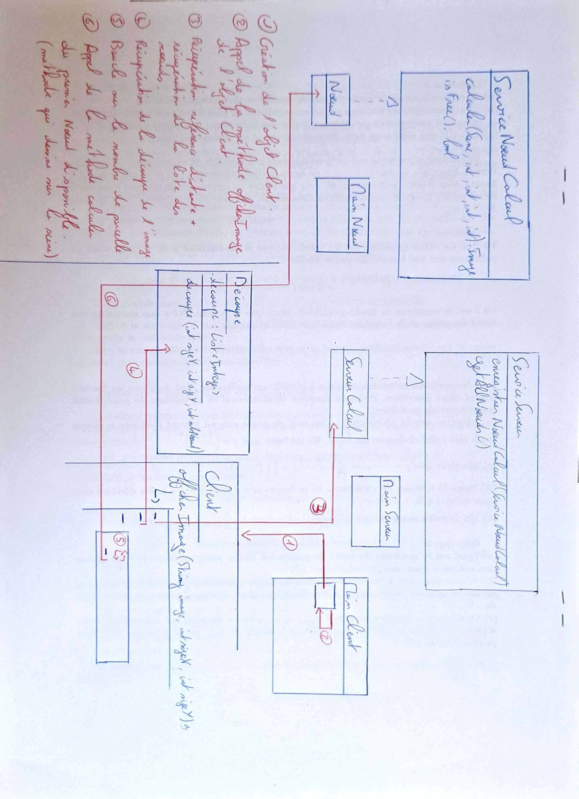

# Rapport du projet de programmation répartie 

### Membres du groupe : 
    - AUBERT Tom
    - CARNET Alexander
    - ANTOINE Paul
    - PETELOT Matthieu

# Remarques 

Vous trouverez dans ce .md tout ce qui a été demandé (schema, code des interfaces, réponse aux questions) avec les explications de la vidéo de démonstration à la toute fin.

# Questions

### En utilisant votre meilleur outil, votre imagination, décrivez et illustrez comment cela pourrait être réalisé, sans rentrer dans les détails JAVA, que vous n'allez pas tarder à mettre en œuvre.

>- Nous pourrions découper l'image en sections de taille similaire, chaque processus s'occuperait de traiter une section de sorte à optimiser le temps de traitement global.

### Tester le programme en modifiant ses paramètres (sur la ligne de commande).

> 

### Observer le temps de d'exécution en fonction de la taille de l'image calculée. Vous pouvez faire une courbe (temps de calcul et tailles d'image).

> Calcul de l'image :
> - Coordonnées : 0,0
> - Taille 512x512
> Image calculée en :2934 ms
>
> Graphe de performance :
>
> 


### En ne modifiant que le fichier LancerRaytracer.java, reproduire l'image suivante :

> Afin de créer cette oeuvre d'art, nous avons modifié les coordonnées du point de départ de la méthode compute (x0 et y0) et la largeur/hauteur de la zone calculée.
> On calcul donc 2 parties de l'image, du coin supérieur gauche jusqu'au milieu (donc longeur/2 et hauteur/2) et on recommence en commençant cette fois si depuis le milieu de l'image.

> 

### Faire un petit schéma de cette architecture en identifiant les choses suivantes 


#### Le/les processus fixes (ceux qui écoutent sur un port choisi) et les processus mobiles ? (ceux qui rentrent et sortent a leur guise) ?

> | Processus | Description |
> | --------- |------------- |
> |Client | Mobile      |
> |Server | Fixe        |
> |Noeud | Fixe        |

#### Les types des données échangées entre les processus  

> Server -(ServiceNoeudCalcul)-> Client
>
> Client -(Scene)-> Noeud
>
> Noeud -(Image)-> Client

Ce qui donne le schéma suivant 

> 
> Légende : 
>   - 1 : Création de l'objet Client
>   - 2 : Appel de la méthode afficherImage de l'objet Client
>   - 3 : Récupération de la référence distante du serveur + récupération de la liste des noeuds
>   - 4 : Récupération de la découpe de l'image 
>   - 5 : Boucle sur le nombre de parcelle
>   - 6 : Appel de la méthode calculer du premier Noeud disponible (méthode qui dessine sur la scène)

Voici donc les codes des interfaces : 

>Interface ServiceServeur : 
>```
>package src.Server;
>
>import java.rmi.Remote;
>import java.rmi.RemoteException;
>import java.util.List;
>
>import src.Noeud.ServiceNoeudCalcul;
>
>public interface ServiceServeur extends Remote {
>
>    public boolean enregistrerNoeudCalcul(ServiceNoeudCalcul serv) throws RemoteException;
>
>    public List<ServiceNoeudCalcul> getAllNoeuds() throws RemoteException;
>
>}

>Interface ServiceNoeudCalcul :
>```
>package src.Noeud;
>import java.rmi.Remote;
>import java.rmi.RemoteException;
>
>import src.raytracer.Image;
>import src.raytracer.Scene;
>
>public interface ServiceNoeudCalcul extends Remote {
>
>    public Image calculer(Scene s,int x0, int y0, int largeur, int hauteur) throws RemoteException;
>
>   public boolean isFree() throws RemoteException;
>}

#### Si on veux que les calculs se fassent en parallèle que faut-il faire ?

>- On peut implémenter un système de multithreading, les calculs sont lancés dans des threads ce qui permet de ne pas avoir à attendre que chaque parcelle soit calculée puis affichée.

### Lancez-vous et réalisez cette application répartie ! Vérifiez que le calcul est bien accéléré.

Nous n'avons pas de graphique représentant le temps d'exécution total pour plusieurs valeurs de résolution différentes mais voici quelques résultats précis : 

Résolution 3000 * 3000 : 20 sec
Résolution 2000 * 2000 : 12 sec
Résolution 1000 * 1000 : 3 sec

Globalement, on remarque que les temps d'exécution sont beaucoup plus faibles qu'avant, ce qui est normal grâce aux threads.

## Explication de la démonstration 1

>Dans la démonstration, vous appercevez 4 terminals (terminaux) : 
>   - Haut à gauche : création de 5 noeuds en local
>   - Haut à droite : lancement du serveur
>   - Bas à gauche : lancement du client
>   - Bad à droite : permet simplement d'avoir l'ip du serveur (la machine locale)
> 
> Nous créons donc 5 noeuds locaux, sachant que 5 autres noeuds ont été créés sur une autre machine afin d'utiliser les performances d'une autre machine que le client (but du projet).
> Nous lançons ensuite le client qui va demander l'affichage d'une image en 500 * 500 (paramètre modifiable dans le compile.sh).
