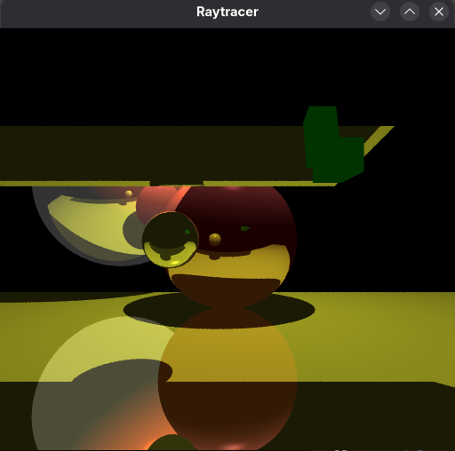
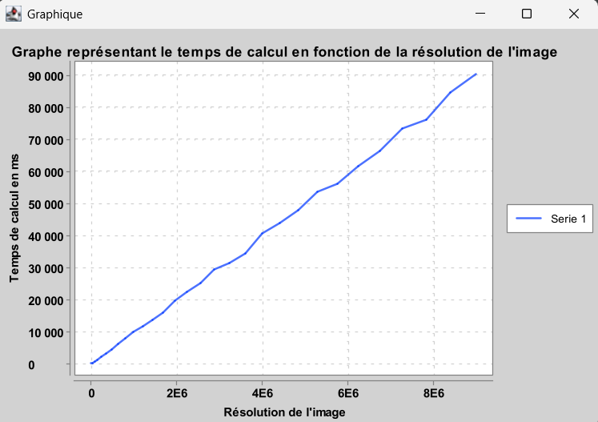
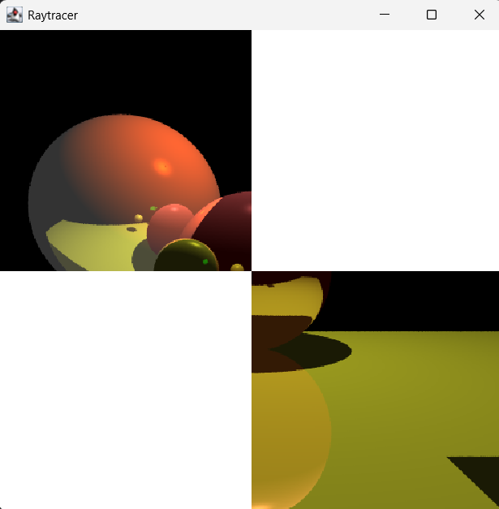

# Features

    - Gestion de Crash
    - Découpe de l'image
    - Server d'adresses
    - Noeud compute

# Questions

### En utilisant votre meilleur outil, votre imagination, décrivez et illustrez comment cela pourrait être réalisé, sans rentrer dans les détails JAVA, que vous n'allez pas tarder à mettre en œuvre.

>- Nous pourrions découper l'image en sections de taille similaire, chaque processus s'occuperait de traiter une section de sorte à optimiser le temps de traitement global.

## Questions :

### Tester le programme en modifiant ses paramètres (sur la ligne de commande).

> 

### Observer le temps de d'exécution en fonction de la taille de l'image calculée. Vous pouvez faire une courbe (temps de calcul et tailles d'image).

> Calcul de l'image :
> - Coordonnées : 0,0
> - Taille 512x512
> Image calculée en :2934 ms
>
> Graphe de performance :
>
> 

### En ne modifiant que le fichier LancerRaytracer.java, reproduire l'image suivante :

> Afin de créer cette oeuvre d'art, nous avons modifié les coordonnées du point de départ de la méthode compute (x0 et y0) et la largeur/hauteur de la zone calculée.
> 

## Questions :

### Faire un petit schéma de cette architecture en identifiant les choses suivantes 

>- 

#### Le/les processus fixes (ceux qui écoutent sur un port choisi) et les processus mobiles ? (ceux qui rentrent et sortent a leur guise) ?

> | Processus | Description |
> | ----------- | ----------- |
> | Client | Mobile |
> | Server | Fixe |
> |Noeud | Fixe |

#### Les types des données échangées entre les processus  

> Server -(ServiceNoeudCalcul)-> Client
>
> Client -(Scene)-> Noeud
>
> Noeud -(Image)-> Client

#### Si on veux que les calculs se fassent en parallèle que faut-il faire ?

>- On peut implémenter un système de multithreading 

### Lancez-vous et réalisez cette application répartie ! Vérifiez que le calcul est bien accéléré.

En refaisant les calculs, avec des résolutions de 1000*1000 à 2000*2000 par palier de 200 (1200*1200, 1400*1400, ...) on obtient les résultats suivants
